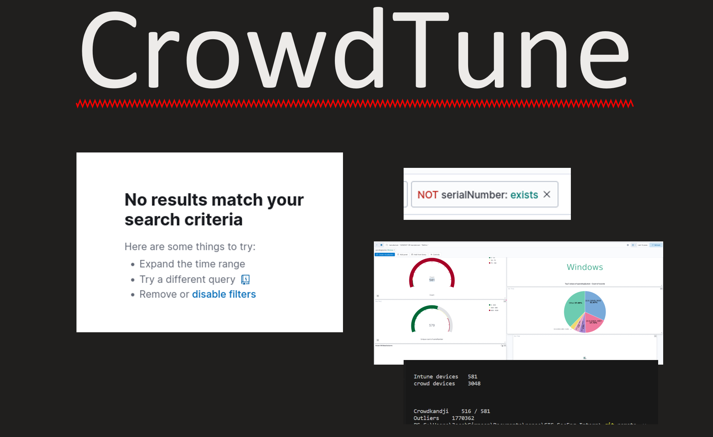
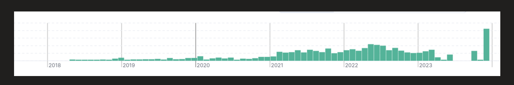
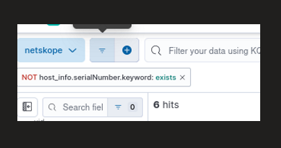
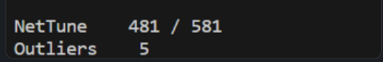
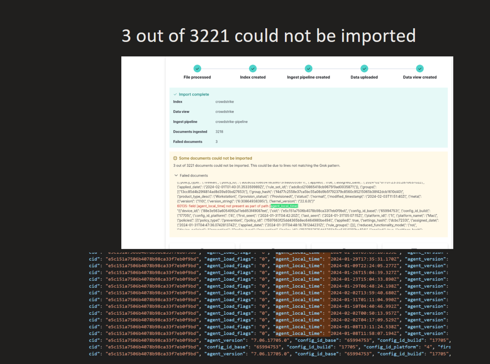
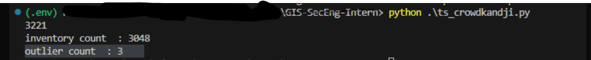
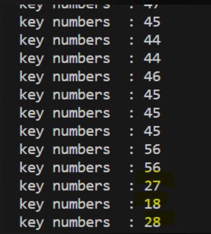

# Looker Studio Dashboard 
v 0.1


## Exporting Complete Data

> Automox, Crowdstrike, Neskope, Intune, Kandji

```
python ts_party.py -r    # main function -- performs full API export and performs transforms.
# or 
python Extract_Scripts/crowd_control.py  # API export script
```

* output path:  'Extract_Scripts/out_data'


## Transforming Data
The following scripts are functions that return a dictionary object filtered by LENOVO, Dell Inc, and Apple.

- ts_crowdkandji.py
- ts_crowdtune.py
- ts_autokandji.py
- ts_autotune.py
- ts_netkandji.py
- ts_nettune.py

> note that these transform scripts have the ability to report outliers. 

#### Run calculations.

Party files will gather and run the transform functions for each security stack and report on those determinations.


```bash
# without -r
python ts_party.py 
```

reports are formatted STACK/MDM_Solution
	- example:
* Crowdstrike/Kandji and Crowdstrike/Intune

Transformed exports can be found here: 

* ts_output/crowdkandji.json
* ts_output/crowdtune.json
* ts_output/autokandji.json
* ts_output/autotune.json
* ts_output/netkandji.json
* ts_output/nettune.json

## How data is verified

> Unique identifiers such as SerialNumber were checked in SIEMS. (NOT serialNumber: exists) is used to find outliers for fields required for crossreferencing. Once a Record Count, Unique SerialNumber Count, or Outliers Count is determined using SIEMs, we can use that data as a reference point for writing the ts_party scripts.


---


## Bugs/Issues

#### ACCUMULATED EVENTS 

> Events span over many years with the possibility of dormant devices lingering in the data

#### NETSKOPE


> Netskope logs have missing serialNumbers in logs. These logs are reported as outliers in ts_party_nettune.py 


> 5 oultiers without SerialNumber were LENOVO,Dell Inc., or Apple. the 6th was filtered out as it was a different Manufacturer.


### Crowdstrike 


>  Crowdstike logs have missing serialNumbers,manufacturers,agent_verison flags and more in logs. These 3 logs are reported as outliers in ts_crowdkandji.py



> Varying key lengths but average is 45-55 keys in Crowdstrike logs. Some are comparably low on agent reporting keys in the complete data.


# Dashboard Compatibility 

- newline delimited json LookerStudio and SIEMs.


